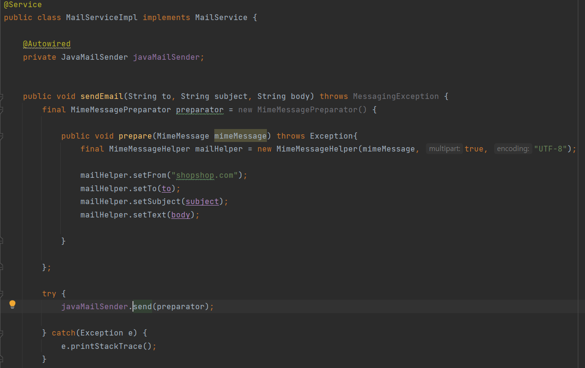
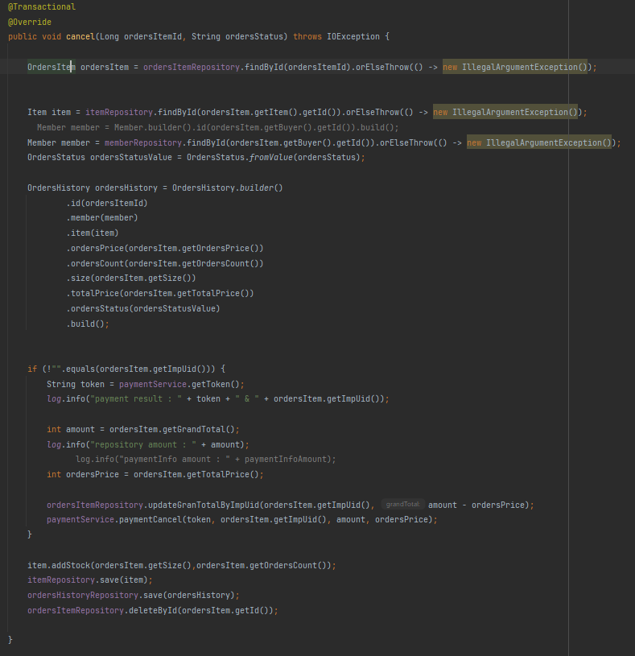

## 스프링 부트 기반 쇼핑몰 구현 프로젝트 SHOPSHOP

### 개요
- 스프링부트 개인 학습을 위한 가상 쇼핑몰 구현 프로젝트
- 기본적인 기능을 구현하여 어느정도 개연성 있는 프로젝트롤 목표로 하였음

### 사용 기술

#### 백엔드
- JAVA 11
- Spring Boot
- Spring Security 
- Spring Data JPA
- Spring MVC

### 데이터베이스
- MySQL

###프론트엔드
- Thymeleaf
- Bootstrap
- JQuery

### 배포
- AWS Lightsail
- AWS Route53 (도메인 적용)
- Lightsail Load Balancer  (인증서 이용하여 HTTPS 적용)

  
## ERD 설계

### 엔티티 역할
- Member : 회원 정보
- MemberRoleRequest : 회원 권한 요청 (일반유저, 판매자, 매니저, 어드민)
- Item : 아이템 정보 (판매자 회원 정보 저장)
- ItemImage : 아이템 이미지 (아이템과 다대일 매핑)
- Category : 아이템 카테고리
- Cart : 장바구니 정보 (멤버와 일대일 매핑)
- CartItem : 장바구니에 담은 아이템 정보
- OrdersItem : 장바구니에서 주문한 아이템 정보 (배송준비중, 배송중, 배송완료, 취소요청, 취소, 완료 단계 & 구매자 회원 정보 저장)
- OrdersHistory : 역대 주문 내역 (취소나 완료가 되었을 때 OrdersItem 정보, 멤버와 다대일 매핑, 구매자 회원정보 저장)
- Likes : 좋아요 정보 (멤버와 일대일, 아이템과 일대일 매핑)
- Review : 후기 정보 (멤버와 다대일, 아이템과 다대일 매핑)
- Board : Q&A 글쓰기 
- Comment : Q&A 댓글

### 기능

메인페이지

회원가입

이메일을 입력하고 인증번호를 보내면 이메일로 인증번호를 발송

인증번호를 올바르게 입력하면 인증 성공 이후 회원가입 폼 제출 가능

다음 주소 API를 이용한 주소 입력 가능

틀린 인증 번호를 적으면 회원가입 진행 불가

JAVAMailSender 구현코드

판매자 권한을 가진 멤버로 로그인하여 아이템 등록

조건에 맞지않는 값 입력후 제출시 error label 출력

올바른 값 입력후 제출

아이템 입력후 메인페이지 조회 화면

라디오 버튼을 통한 카테고리별 검색

구현 코드\
enum 타입의 카테고리 요소들을 DB에 저장

기본 페이지에 접근할 때, 검색어의 여부 혹은 카테고리 요소의 여부\
세가지 조건에 따라 오버로딩을 통해 서비스는 다른 비즈니스 로직을 실행 

리포지토리의 코드 \
기본 페이지 접근, 검색어 입력 아이템 조회, 카테고리 입력 아이템 조회 코드

아이템 조회, 좋아요, 장바구니 담기

장바구니 주문\
포인트 사용 후 아임포트 API 기반 결제\
카드 결제와 카카오 결제 가능

현재 주문 상태 \
하나는 취소할 것  하나는 결제할 것

판매자 계정 판매자 페이지에서 주문 관리

주문 완료 코드\
주문아이템 객체 정보로 주문내역 객체 생성 후 DB에 적용\
총 결제 금액의 5% 포인트 적립

주문 취소 코드\
payment 서비스에서 결제 총 금액을 유지 \
총 금액에서 결제 취소금액 만큼을 빼서 유지\
주문 취소 상태로 주문 내역에 저장, 아이템 수량 복구\

주문 내역 화면

리뷰 등록\
주문 완료된 아이템만 리뷰 가능, 리뷰 중복 불가능

기타 기능
평점순 아이템 조회, 좋아요한 아이템, 작성한 리뷰 조회

## 기능 정리

### 회원
- 회원 등록
- 비밀번호 찾기  
- 이메일 인증 (회원 등록, 비밀번호 찾기)
- 로그인
- 회원정보 조회, 변경  
- 권한요청, 권한 인증

### 상품
- 상품 등록
- 상품 변경

#### 상품 조회

- 모든 상품 조회
- 카테고리별 상품 조회
- 상품명 검색 조회
- 로그인 회원이 좋아요한 상품 조회
- 로그인 판매자가 등록한 상품 조회
- 평점순 상품 조회
- 상품 조회

### 장바구니
- 장바구니 등록
- 장바구니 조회
- 장바구니 아이템 사이즈, 수량 변경
- 장바구니 삭제

### 주문
- 포인트 사용
- 카드, 카카오 결제
- 주문 취소, 주문 상태  변경 
- 현재 주문 상태
- 주문 내역 조회
- 판매자 주문 관리 페이지

### 리뷰
- 리뷰, 평점 등록
- 리뷰 수정, 삭제
- 로그인한 멤버가 작성한 리뷰 보기

### 좋아요
- 좋아요 등록, 삭제 

### Q&A 페이지
- 질문 글 등록, 수정, 삭제
- 질문 안에 댓글 기능